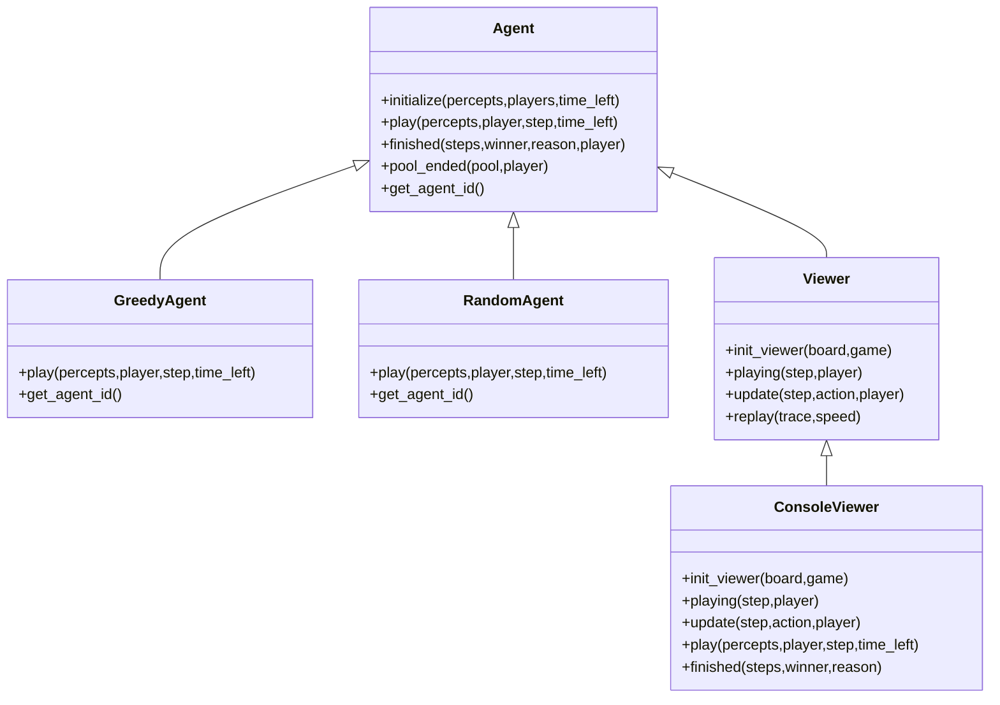

# Avalam-AI

Some ideas available [here](https://md.picasoft.net/s/4HP7m5HFT)

```mermaid
classDiagram
class Agent {
  +initialize(percepts,players,time_left) 
  +play(percepts,player,step,time_left) 
  +finished(steps,winner,reason,player) 
  +pool_ended(pool,player) 
  +get_agent_id() 
}
Agent <|-- GreedyAgent
Agent <|-- RandomAgent
Agent <|-- Viewer
class Viewer {
  +init_viewer(board,game) 
  +playing(step,player) 
  +update(step,action,player) 
  +replay(trace,speed) 
}
Viewer <|-- ConsoleViewer
class ConsoleViewer {
  +init_viewer(board,game) 
  +playing(step,player) 
  +update(step,action,player) 
  +play(percepts,player,step,time_left) 
  +finished(steps,winner,reason) 
}
class RandomAgent {
  +play(percepts,player,step,time_left) 
  +get_agent_id() 
}
class GreedyAgent {
  +play(percepts,player,step,time_left) 
  +get_agent_id() 
}
```