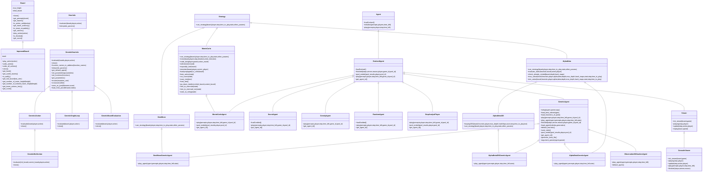

# Avalam-AI

Check the [project report](./Rapport.pdf)

## Class diagram

```mermaid
classDiagram
class ImprovedBoard {
 mask
  +play_action(action) 
  +undo_action() 
  +undo_all_actions() 
  +clone() 
  +get_hash() 
  +get_useful_towers() 
  +is_wall(i,j) 
  +get_real_board(not_zero) 
  +get_number_of_tower_height(height) 
  +get_number_of_isolated_tower_height(height) 
  +get_tower_actions_len(i,j) 
  +get_score() 
}
click ImprovedBoard href "https://github.com/StephaneBranly/Avalam-AI/blob/main/doc/ImprovedBoard.md" "Detail of the class ImprovedBoard"
class Board {
 max_height
 initial_board
  +clone() 
  +get_percepts(invert) 
  +get_towers() 
  +is_action_valid(action) 
  +get_tower_actions(i,j) 
  +is_tower_movable(i,j) 
  +get_actions() 
  +play_action(action) 
  +is_finished() 
  +get_score() 
}
click Board href "https://github.com/StephaneBranly/Avalam-AI/blob/main/doc/Board.md" "Detail of the class Board"
Board <|-- ImprovedBoard
class Heuristic {
  +evaluate(board,player,action) 
  +interprete_params() 
}
click Heuristic href "https://github.com/StephaneBranly/Avalam-AI/blob/main/doc/Heuristic.md" "Detail of the class Heuristic"
Heuristic <|-- GeneticHeuristic
class GeneticHeuristic {
  +evaluate(boards,player,action) 
  +clone() 
  +function_names_to_address(function_names) 
  +interprete_params() 
  +get_default_agent() 
  +set_parameters(parameters) 
  +set_functions(functions) 
  +get_parameters() 
  +mutate(mutation_rate) 
  +crossover(other) 
  +save_as_json(filename,score) 
  +load_from_json(filename,index) 
}
click GeneticHeuristic href "https://github.com/StephaneBranly/Avalam-AI/blob/main/doc/GeneticHeuristic.md" "Detail of the class GeneticHeuristic"
GeneticHeuristic <|-- Genetic1Action
GeneticHeuristic <|-- GeneticSingleLoop
GeneticHeuristic <|-- GeneticBoardEvaluation
class GeneticBoardEvaluation {
  +evaluate(board,player,action) 
  +clone() 
}
click GeneticBoardEvaluation href "https://github.com/StephaneBranly/Avalam-AI/blob/main/doc/GeneticBoardEvaluation.md" "Detail of the class GeneticBoardEvaluation"
class GeneticSingleLoop {
  +evaluate(board,player,action) 
  +clone() 
}
click GeneticSingleLoop href "https://github.com/StephaneBranly/Avalam-AI/blob/main/doc/GeneticSingleLoop.md" "Detail of the class GeneticSingleLoop"
class Genetic1Action {
  +evaluate(board,player,action) 
  +clone() 
}
click Genetic1Action href "https://github.com/StephaneBranly/Avalam-AI/blob/main/doc/Genetic1Action.md" "Detail of the class Genetic1Action"
Genetic1Action <|-- GeneticMultAction
class GeneticMultAction {
  +evaluate(init_board,current_board,player,action) 
  +clone() 
}
click GeneticMultAction href "https://github.com/StephaneBranly/Avalam-AI/blob/main/doc/GeneticMultAction.md" "Detail of the class GeneticMultAction"
class Agent {
  +hasEvolved() 
  +initialize(percepts,players,time_left) 
  +play(percepts,player,step,time_left) 
}
click Agent href "https://github.com/StephaneBranly/Avalam-AI/blob/main/doc/Agent.md" "Detail of the class Agent"
Agent <|-- EvolvedAgent
class EvolvedAgent {
  +hasEvolved() 
  +finished(steps,winner,reason,player,game_id,pool_id) 
  +pool_ended(pool_results,player,pool_id) 
  +play(percepts,player,step,time_left,game_id,pool_id) 
  +get_agent_id() 
}
click EvolvedAgent href "https://github.com/StephaneBranly/Avalam-AI/blob/main/doc/EvolvedAgent.md" "Detail of the class EvolvedAgent"
EvolvedAgent <|-- GeneticAgent
EvolvedAgent <|-- MonteCarloAgent
EvolvedAgent <|-- SecretAgent
EvolvedAgent <|-- GreedyAgent
EvolvedAgent <|-- RandomAgent
EvolvedAgent <|-- StepAnalystPlayer
EvolvedAgent <|-- Viewer
class Viewer {
  +init_viewer(board,game) 
  +playing(step,player) 
  +update(step,action,player) 
  +replay(trace,speed) 
}
click Viewer href "https://github.com/StephaneBranly/Avalam-AI/blob/main/doc/Viewer.md" "Detail of the class Viewer"
Viewer <|-- ConsoleViewer
class ConsoleViewer {
  +init_viewer(board,game) 
  +playing(step,player) 
  +update(step,action,player) 
  +play(percepts,player,step,time_left) 
  +finished(steps,winner,reason) 
}
click ConsoleViewer href "https://github.com/StephaneBranly/Avalam-AI/blob/main/doc/ConsoleViewer.md" "Detail of the class ConsoleViewer"
class StepAnalystPlayer {
  +play(percepts,player,step,time_left,game_id,pool_id) 
  +pool_ended(pool_results,player,pool_id) 
  +get_agent_id() 
}
click StepAnalystPlayer href "https://github.com/StephaneBranly/Avalam-AI/blob/main/doc/StepAnalystPlayer.md" "Detail of the class StepAnalystPlayer"
class RandomAgent {
  +hasEvolded() 
  +play(percepts,player,step,time_left,game_id,pool_id) 
  +get_agent_id() 
}
click RandomAgent href "https://github.com/StephaneBranly/Avalam-AI/blob/main/doc/RandomAgent.md" "Detail of the class RandomAgent"
class GreedyAgent {
  +play(percepts,player,step,time_left,game_id,pool_id) 
  +get_agent_id() 
}
click GreedyAgent href "https://github.com/StephaneBranly/Avalam-AI/blob/main/doc/GreedyAgent.md" "Detail of the class GreedyAgent"
class SecretAgent {
  +hasEvolded() 
  +play(percepts,player,step,time_left,game_id,pool_id) 
  +get_agent_id() 
}
click SecretAgent href "https://github.com/StephaneBranly/Avalam-AI/blob/main/doc/SecretAgent.md" "Detail of the class SecretAgent"
class MonteCarloAgent {
  +play(percepts,player,step,time_left,game_id,pool_id) 
  +pool_ended(pool_results,player,pool_id) 
  +get_agent_id() 
}
click MonteCarloAgent href "https://github.com/StephaneBranly/Avalam-AI/blob/main/doc/MonteCarloAgent.md" "Detail of the class MonteCarloAgent"
class MonteCarlo {
  +use_strategy(board,player,step,time_to_play,stats,other_params) 
  +mcts(board,player,step,iterations,time_limit,tree) 
  +node_dict(player,parent,action_made) 
  +select(state,board) 
  +expand(n_leaf,board) 
  +simulate(board,player,current_player) 
  +backpropagate(v,n_child,board) 
  +best_action(state) 
  +uct_score(node) 
  +save_tree(tree) 
  +load_tree() 
  +go_down_tree(tree,initial_board,current_board) 
  +tree_to_mermaid(state) 
  +tree_to_mermaid_rec(state) 
  +state_to_string(state) 
}
click MonteCarlo href "https://github.com/StephaneBranly/Avalam-AI/blob/main/doc/MonteCarlo.md" "Detail of the class MonteCarlo"
MonteCarlo <|-- MonteCarloAgent
class Strategy {
  +use_strategy(board,player,step,time_to_play,stats,other_params) 
}
click Strategy href "https://github.com/StephaneBranly/Avalam-AI/blob/main/doc/Strategy.md" "Detail of the class Strategy"
Strategy <|-- BestMove
Strategy <|-- MonteCarlo
Strategy <|-- AlphaBeta
class AlphaBeta {
  +use_strategy(board,player,step,time_to_play,stats,other_params) 
  +evaluate_state(heuristic,board,action,player) 
  +check_already_visited(board,depth,hash_maps) 
  +max_value(board,heuristic,player,alpha,beta,depth,max_depth,hash_maps,start,step,time_to_play) 
  +min_value(board,heuristic,player,alpha,beta,depth,max_depth,hash_maps,start,step,time_to_play) 
}
click AlphaBeta href "https://github.com/StephaneBranly/Avalam-AI/blob/main/doc/AlphaBeta.md" "Detail of the class AlphaBeta"
AlphaBeta <|-- AlphaBetaIDS
AlphaBeta <|-- AlphaBetaGeneticAgent
class AlphaBetaGeneticAgent {
  +play_agent(agent,percepts,player,step,time_left,stats) 
}
click AlphaBetaGeneticAgent href "https://github.com/StephaneBranly/Avalam-AI/blob/main/doc/AlphaBetaGeneticAgent.md" "Detail of the class AlphaBetaGeneticAgent"
class GeneticAgent {
  +setup(agent,parser,args) 
  +load_best_individu(gen) 
  +load_heuristics_of_pool() 
  +play(percepts,player,step,time_left,game_id,pool_id) 
  +play_agent(agent,percepts,player,step,time_left,stats) 
  +finished(steps,winner,reason,player,game_id,pool_id) 
  +load_agent(individu,generation) 
  +default_heuristic() 
  +save_stats() 
  +pool_ended(pool_results,player,pool_id) 
  +get_agent_id() 
  +generate_stats_file() 
  +argument_parser(agent,parser) 
}
click GeneticAgent href "https://github.com/StephaneBranly/Avalam-AI/blob/main/doc/GeneticAgent.md" "Detail of the class GeneticAgent"
GeneticAgent <|-- BestMoveGeneticAgent
GeneticAgent <|-- AlphaBetaIDSGeneticAgent
GeneticAgent <|-- ObservationNN1actionAgent
GeneticAgent <|-- AlphaBetaGeneticAgent
class ObservationNN1actionAgent {
  +play_agent(agent,percepts,player,step,time_left) 
  +default_agent() 
}
click ObservationNN1actionAgent href "https://github.com/StephaneBranly/Avalam-AI/blob/main/doc/ObservationNN1actionAgent.md" "Detail of the class ObservationNN1actionAgent"
class AlphaBetaIDSGeneticAgent {
  +play_agent(agent,percepts,player,step,time_left,stats) 
}
click AlphaBetaIDSGeneticAgent href "https://github.com/StephaneBranly/Avalam-AI/blob/main/doc/AlphaBetaIDSGeneticAgent.md" "Detail of the class AlphaBetaIDSGeneticAgent"
class AlphaBetaIDS {
  +loopingIDS(board,heuristic,player,max_depth,hashMaps,start,step,time_to_play,last) 
  +use_strategy(board,player,step,time_to_play,stats,other_params) 
}
click AlphaBetaIDS href "https://github.com/StephaneBranly/Avalam-AI/blob/main/doc/AlphaBetaIDS.md" "Detail of the class AlphaBetaIDS"
AlphaBetaIDS <|-- AlphaBetaIDSGeneticAgent
class BestMoveGeneticAgent {
  +play_agent(agent,percepts,player,step,time_left,stats) 
}
click BestMoveGeneticAgent href "https://github.com/StephaneBranly/Avalam-AI/blob/main/doc/BestMoveGeneticAgent.md" "Detail of the class BestMoveGeneticAgent"
class BestMove {
  +use_strategy(board,player,step,time_to_play,stats,other_params) 
}
click BestMove href "https://github.com/StephaneBranly/Avalam-AI/blob/main/doc/BestMove.md" "Detail of the class BestMove"
BestMove <|-- BestMoveGeneticAgent
```
